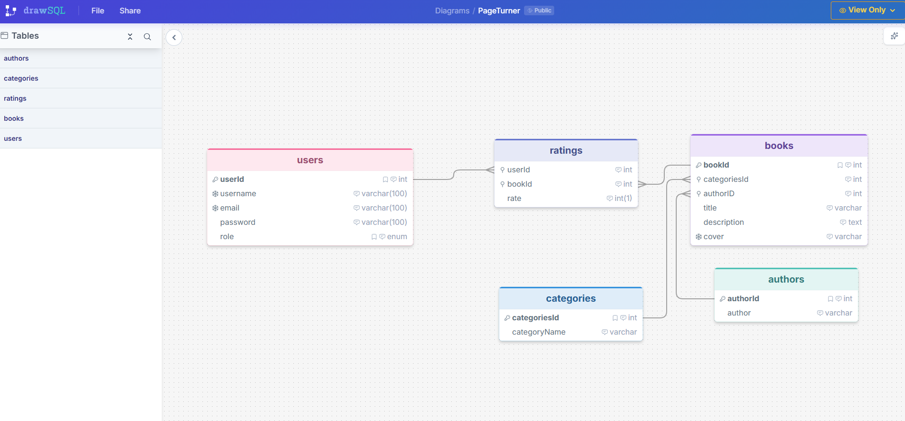
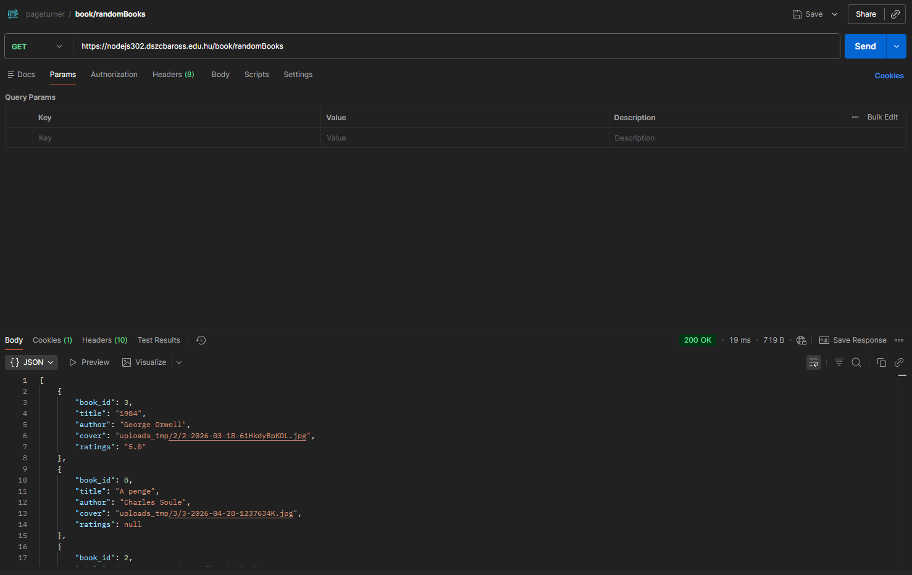

# 📚 PageTurner - Backend


## 📋 Tartalomjegyzék

- [A projektről](#-a-projektről)
- [Főbb funkciók](#-főbb-funkciók)
- [Technológiai stack](#-technológiai-stack)
- [Adatbázis struktúra](#-adatbázis-struktúra)
- [Projekt struktúra](#-projekt-struktúra)
- [Telepítés és futtatás](#-telepítés-és-futtatás)
- [Környezeti változók](#-környezeti-változók)
- [API végpontok](#-api-végpontok)
- [Middleware-ek](#-middleware-ek)
- [Használt függőségek](#-használt-függőségek)

---

## 🎯 A projektről

A PageTurner egy könyvajánló webalkalmazás backendje. Az alkalmazás lehetővé teszi a felhasználóknak, hogy könyveket böngésszenek, értékeljenek, és kezeljék saját profiljukat. Az adminisztrátorok könyveket és felhasználókat kezelhetnek.

👉 [Frontend repo](https://github.com/Vandush230517/PageTurner_Frontend.git)
👉 [DrawSQL adatbázis diagram](https://drawsql.app/teams/123456-15/diagrams/pageturner)

---

## ✨ Főbb funkciók

- 🔐 **Felhasználói hitelesítés** - JWT alapú bejelentkezés és regisztráció
- 📖 **Könyvkezelés** - Könyvek listázása, létrehozása, szerkesztése, törlése
- ⭐ **Értékelési rendszer** - Könyvek értékelése és értékelések törlése
- 👤 **Profil kezelés** - Felhasználónév, email és jelszó módosítása
- 🛡️ **Admin panel** - Felhasználók és könyvek adminisztrálása
- 🔍 **Keresés és szűrés** - Könyvek keresése és kategória szerinti szűrés
- 📸 **Képfeltöltés** - Könyvborítók feltöltése

---

## 🛠️ Technológiai stack

| Technológia | Verzió | Leírás |
|-------------|--------|--------|
| Node.js | 18+ | Szerver oldali JavaScript |
| Express | 4.x | Web framework |
| MySQL2 | 3.x | Adatbázis kapcsolat |
| bcrypt | 5.x | Jelszó hashelés |
| jsonwebtoken | 9.x | JWT authentikáció |
| multer | 1.x | Fájl feltöltés |
| cookie-parser | 1.x | Cookie kezelés |
| cors | 2.x | Cross-origin kérések |
| dotenv | 16.x | Környezeti változók |

---

## 🗄️ Adatbázis struktúra

👉 [DrawSQL diagram megtekintése](https://drawsql.app/teams/123456-15/diagrams/pageturner)

| Tábla | Leírás | Főbb mezők |
|-------|--------|------------|
| `users` | Felhasználói fiókok | user_id, username, email, password, role |
| `books` | Könyvek adatai | book_id, title, description, cover, author_id, categories_id |
| `authors` | Szerzők | author_id, author |
| `categories` | Kategóriák | categories_id, categoryName |
| `ratings` | Könyv értékelések | user_id, book_id, rate |

---

## 📂 Projekt struktúra

```
pageturner-backend/
├── config/
│   └── dotenvConfig.js        # Környezeti változók
├── controllers/
│   ├── userController.js      # Felhasználó logika
│   ├── bookController.js      # Könyv logika
│   └── adminController.js     # Admin logika
├── middleware/
│   ├── userMiddleware.js      # JWT auth middleware
│   ├── isAdminMiddleware.js   # Admin jogosultság
│   └── bookUploadMiddleware.js # Képfeltöltés
├── models/
│   ├── userModel.js           # Felhasználó SQL lekérdezések
│   ├── bookModel.js           # Könyv SQL lekérdezések
│   └── adminModel.js          # Admin SQL lekérdezések
├── routes/
│   ├── userRoutes.js          # Felhasználó útvonalak
│   ├── bookRoutes.js          # Könyv útvonalak
│   └── adminRoutes.js         # Admin útvonalak
├── db/
│   └── db.js                  # Adatbázis kapcsolat
├── uploads_tmp/               # Feltöltött képek
├── .env                       # Környezeti változók
└── index.js                   # Belépési pont
```

---

## 🚀 Telepítés és futtatás

```bash
# Repo klónozása
git clone https://github.com/bogzbogz/pageturner.git

# Mappába lépés
cd pageturner

# Függőségek telepítése
npm install

# Szerver indítása
node index.js

# Vagy fejlesztői módban
npm run dev
```

---

## 🔧 Környezeti változók

Hozz létre egy `.env` fájlt a projekt gyökérkönyvtárában:

```env
HOST=127.0.0.1
PORT=3000

DB_HOST=localhost
DB_USER=root
DB_PASSWORD=
DB_NAME=pageturner
DB_TIMEZONE=Z

JWT_SECRET=titkos_jelszo
JWT_EXPIRES_IN=7d

COOKIE_NAME=token
```

---

## 🌐 API végpontok

### 👤 Felhasználó útvonalak (`/users`)

| Metódus | Útvonal | Leírás | Védett |
|---------|---------|--------|--------|
| POST | `/users/register` | Regisztráció | ❌ |
| POST | `/users/login` | Bejelentkezés | ❌ |
| GET | `/users/whoami` | Bejelentkezett user adatai | ✅ |
| POST | `/users/logout` | Kijelentkezés | ✅ |
| PUT | `/users/editUsername` | Felhasználónév módosítás | ✅ |
| PUT | `/users/editEmail` | Email módosítás | ✅ |
| PUT | `/users/editPassword` | Jelszó módosítás | ✅ |

### 📖 Könyv útvonalak (`/book`)

| Metódus | Útvonal | Leírás | Védett |
|---------|---------|--------|--------|
| GET | `/book/cardBooks` | Összes könyv | ❌ |
| GET | `/book/getBook/:id` | Könyv lekérése ID alapján | ❌ |
| GET | `/book/randomBooks` | Véletlenszerű könyvek | ❌ |
| GET | `/book/userRatedBooks` | Felhasználó értékelt könyvei | ✅ |
| GET | `/book/category/:id` | Kategória szerinti szűrés | ✅ |
| GET | `/book/search/:query` | Keresés | ❌ |
| POST | `/book/rating/:id` | Értékelés hozzáadása | ✅ |
| DELETE | `/book/rating/:id` | Értékelés törlése | ✅ |
| POST | `/book/createBook` | Könyv létrehozása | ✅ |

### 🛡️ Admin útvonalak (`/admin`)

| Metódus | Útvonal | Leírás | Védett |
|---------|---------|--------|--------|
| GET | `/admin/allUser` | Összes felhasználó | ✅ Admin |
| GET | `/admin/allBooks` | Összes könyv | ✅ Admin |
| PUT | `/admin/admin/edit/:user_id` | Felhasználó szerkesztése | ✅ Admin |
| DELETE | `/admin/admin/delete/:user_id` | Felhasználó törlése | ✅ Admin |
| PUT | `/admin/admin/book/edit/:book_id` | Könyv szerkesztése | ✅ Admin |
| DELETE | `/admin/admin/book/delete/:book_id` | Könyv törlése | ✅ Admin |

## 📬 API tesztelés (Postman)



---

## 🔒 Middleware-ek

- **`auth`** — JWT token ellenőrzése, védett végpontokhoz szükséges
- **`isAdmin`** — Admin szerepkör ellenőrzése
- **`upload`** — Multer alapú képfeltöltés kezelése

---

## 📦 Használt függőségek

```json
{
  "dependencies": {
    "bcrypt": "^5.1.1",
    "cookie-parser": "^1.4.7",
    "cors": "^2.8.5",
    "dotenv": "^16.4.5",
    "express": "^4.21.1",
    "jsonwebtoken": "^9.0.2",
    "multer": "^1.4.5-lts.1",
    "mysql2": "^3.11.4"
  },
  "devDependencies": {
    "nodemon": "^3.1.7"
  }
}
```

## 🚀 Jövőbeli tervek

- ⭐ Könyvek értékelésének teljes implementálása (rating rendszer fejlesztése)
- 💬 Komment rendszer hozzáadása a könyvekhez
- ❤️ Kedvencek lista kialakítása
- 📊 Felhasználói statisztikák (pl. elolvasott könyvek)
- 🔍 Fejlettebb keresési és szűrési lehetőségek
- 🧱 Adatbázis bővítése és optimalizálása (kommentek, favorites, indexing)